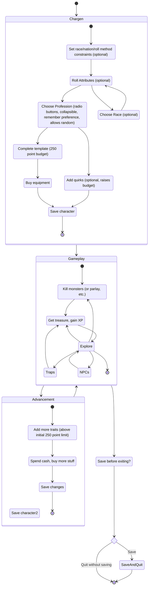

# DFRPG Chargen Design Doc

## Requirements

Supports all DFRPG Adventurers templates
Skills, advantages, disadvantages, quirks
Random attribute generation option
Doesn't double-charge for things that show up in multiple sections, like disadvantages or quirk buys

